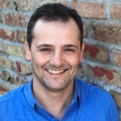

<style type="text/css">
.main-container {
  max-width: 1200px;
  margin-left: auto;
  margin-right: auto;
}

.navbar-collapse.collapse.in {
  display: block!important;
}
</style>

<br/>
<br/>

### Founded in circa 2009-2010, CRUG has become a cornerstone of the Chicago R community. Today, in its second generation of leadership CRUG has grown to over 3,800 members.

### Below are current organizers made up of various analytical backgrounds: from mathematicians and statisticians to data analysts and scientists to economists and transportation planners to professors.

---


```{r echo=FALSE}
library(kableExtra)
```

```{r echo=FALSE}
crug_df <- data.frame(Organizer = c('<h4>Justin Shea</h4>', '<h4>Troy Hernandez</h4>', '<h4>Charlotte Frei</h4>',
                                    '<h4>Adam Ginensky</h4>', '<h4>Parfait Gasana</h4>'),
                      Title = c('<h4>Econ Professor/Consultant,</h4> <h5><i>Frequency trader expert, CPU machine builder, and<br/> conference/co-organizer leader<br/>who advocates <code>base</code> and <code>data.table</code> solutions!</i></h5>', 
                                '<h4>IBM Architect,</h4> <h5><i>Politically active data scientist and statistician<br/>working on 21st C. issues!</i></h5>', 
                                '<h4>Transportation Planner,</h4> <h5><i>Licensed engineer with PhD who uses R in novel ways<br/>with data, maps, and more!</i></h5>',
                                '<h4>Applied Mathematician,</h4> <h5><i>Machine learning connoisseur who brings pure and<br/>applied math to quantitative finance!</i></h5>', 
                                '<h4>Econ Data Analyst,</h4> <h5><i>Polygot analytics expert in Python, SQL, VBA,<br/> and more who looks to extend <code>base</code> R!</i></h5>'),
                      Image = c('',
                                '',
                                '',
                                '',
                                ''))
```


```{r echo=FALSE}
kable_styling(kable(crug_df, escape = FALSE, align = "lcc"),
              bootstrap_options = c("striped", "hover"), font_size = 14)
```


