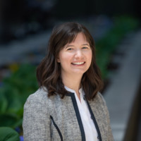

<style type="text/css">
.main-container {
  max-width: 1200px;
  margin-left: auto;
  margin-right: auto;
}

.navbar-collapse.collapse.in {
  display: block!important;
}
</style>

<br/>
<br/>

### Founded in circa 2009-2010, CRUG has become a cornerstone of the Chicago R community. Today, in its second generation of leadership CRUG has grown to over 3,800 members.

### Below are current organizers made up of various analytical backgrounds: from mathematicians and statisticians to data analysts and scientists to economists and transportation planners to professors.

---


```{r echo=FALSE}
library(kableExtra)
```

```{r echo=FALSE}
crug_df <- data.frame(Organizer = c('<h4>Justin Shea</h4>', '<h4>Troy Hernandez</h4>', '<h4>Charlotte Frei</h4>',
                                    '<h4>Adam Ginensky</h4>', '<h4>Parfait Gasana</h4>'),
                      Title = c('<h4>Econ Professor/Consultant</h4>', '<h4>IBM Architect </h4>', 
                                '<h4>Transportation Planner</h4>',
                                '<h4>Applied Mathematician</h4>', '<h4>Econ Data Analyst</h4>'),
                      Image = c('',
                                '',
                                '',
                                '',
                                ''))
```


```{r echo=FALSE}
kable_styling(kable(crug_df, escape = FALSE, align = "lcc"),
              bootstrap_options = c("striped", "hover"), font_size = 14)
```


