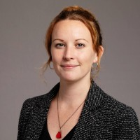

<style type="text/css">
.main-container {
  max-width: 1200px;
  margin-left: auto;
  margin-right: auto;
}

@media (max-width:1200px) and (min-width:760px) {
  #navbar > ul > li > a {
     font-size: 0;
     display:inline-block;
  }
  .fa { font-size: initial; }
}
</style>

<br/>
<br/>

### Founded in circa 2009-2010, CRUG has become a cornerstone of the Chicago R community. Today, in the third generation of leadership, CRUG has grown to over 3,900 members.

### Below are current organizers made up of various analytical backgrounds including mathematicians & statisticians, data analysts & scientists, technology executive architects, financial risk managers, transportation planners, and professors.

---


```{r echo=FALSE}
library(kableExtra)
```

```{r echo=FALSE}
crug_df <- data.frame(Organizer = c('<h4> Anne Corinne Carroll</h4>', '<h4>Parfait Gasana</h4>','<h4>Troy Hernandez, PhD</h4>', '<h4> Gene Leynes </h4','<h4>Justin M Shea</h4>'),
                      Title = c('<h4>Director of Assessment and Evaluation at Rush University</h4> <h5><i>  Quantitative social scientist applying theory and research.<br/> Background includes test development and validation, structural equation modeling, <br/> multilevel modeling, longitudinal analysis, invariance testing, mediation, and moderation</i></h5>',
                                '<h4>Operations Research Analyst at Argonne National Lab</h4> <h5><i> MS in Economics specializing in data analytics <br/> including migration, visualization, aggregation, modeling, database development',
                                '<h4>IBM Executive Architect</h4> <h5><i>Data scientist, activist, and <br/> Chairman of the Cook County Green Party. <br/> https://troyhernandez.com/ </i></h5>',
                                '<h4>Data Scientist at City of Chicago</h4>',
                                '<h4>Director, CCCF Honors Finance/Assistant Professor of Finance</h4> <h5><i>Google Summer of Code R-project Evaluating Mentor, <br/> Quantitative Finance & Data Analytics consultant, and <br/> conference/co-organizer leader</i></h5>'),
                  Image = c('',
                                '',
                                '',
                                '',
                                ''))
```


```{r echo=FALSE}
kable_styling(kable(crug_df, escape = FALSE, align = "lcc"),
              bootstrap_options = c("striped", "hover"), font_size = 14)
```


