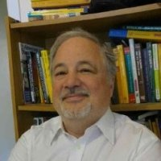

 
 

### Founded in circa 2009-2010, CRUG has become a cornerstone of the Chicago R community. Today, in its second generation of leadership CRUG has grown to over 3,800 members.

### Below are current organizers made up of various analytical backgrounds: from mathematicians and statisticians to data analysts and scientists to economists and transportation planners to professors.

---

## **Justin Shea** 
### Econ Professor/Consultant
 

 

## **Troy Hernandez** 
### IBM Architect 
 

 

## **Charlotte Frei** 
### Transportation Planner 

 

## **Adam Ginensky**
### Applied Mathematician 

 

## **Parfait Gasana** 
### Econ Data Analyst   
   

 

