<table id="headers">
  <tbody>
    <tr>
      <td><a href="index.html">Home</a></td>
      <td><a href="mission.html">Mission</a></td>
      <td><a href="resources.html">Resources</a></td>
      <td><a href="sponsors.html">Sponsors</a></td>
      <td><a href="about-us.html">About Us</a></td>
      <td><a href="find-us.html">Find Us</a></td>
    </tr>
  </tbody>
</table>

# <center>Hello world! Or as we say in byte conversion code:</center>

```r
str <- paste0("48656c6c6f20576f726c642057696465205765622c204772656574696e67732066726f6d204368696361676f205220557365722047726f757021")
hex <- sapply(seq(1, nchar(str), by=2), function(x) substr(str, x, x+1))

print(rawToChar(as.raw(strtoi(hex, 16L))))
# [1] "Hello World Wide Web, Greetings from Chicago R User Group!"
```

Like the open-source, community-active language (actually environment), we are a Chicago-based group of R specialists and enthusiasts here to foster collaboration, education, networking, and engagement among each other and other public and private organizations.

See below our past events and projects, diving into the entire spectrum of data analytics and data science.

---


# <center><strong>2018 Meetups</strong></center><br/>

| [**2018-n7-CRUG-PUG**](https://github.com/Chicago-R-User-Group/2018-n7-CRUG-PUG)             | [**2018-n6-CRUG-ChiPy**](https://github.com/Chicago-R-User-Group/2018-n6-CRUG-ChiPy)                       | [**2018-n5--Pre-RFinance-meetup**](https://github.com/Chicago-R-User-Group/2018-n5--Pre-RFinance-meetup) |
| ...                                                                                          | [**2018-n4-R-from-the-Beginning**](https://github.com/Chicago-R-User-Group/2018-n4-R-from-the-Beginning)   | ...                                                                                                      |
| [**2018-n3-Double-Feature**](https://github.com/Chicago-R-User-Group/2018-n3-Double-Feature) | [**2018-n2-Data-Robot-Talks**](https://github.com/Chicago-R-User-Group/2018-n2)                            | [**2018-n1-Happy-New-YeaR**](https://github.com/Chicago-R-User-Group/2018-n1-Happy-New-YeaR)             |


&nbsp;


# <center><strong>2017 Meetups</strong></center><br/>

| [**2017-n7-Machine-Learning**](https://github.com/Chicago-R-User-Group/2017-n7-Machine-Learning-High-Frequency-Time-Series) | [**2017-n6-SatuRday-short-talks**](https://github.com/Chicago-R-User-Group/2017-n6-meetup-SatuRday-short-talks)  | [**2017-n5-Meetup-SolarFlares**](https://github.com/Chicago-R-User-Group/2017-n5-Meetup-SolarFlares) |
| ...                                                                                                                         | [**2017-n4-Syberia**](https://github.com/Chicago-R-User-Group/2017-n4-Meetup-Syberia)                            | ...                                                                                                  |
| [**2017-n3-Meetup-RStudio**](https://github.com/Chicago-R-User-Group/2017-n3-Meetup-RStudio)                                | [**2017-n2-Predictive-Financial**](https://github.com/Chicago-R-User-Group/2017-n2-Meetup)                       | [**2017-n1-Meetup-New-Year-New-to-R**](https://github.com/Chicago-R-User-Group/2017-n1-Meetup)       |

&nbsp;

# <center><strong>2011-2016 Meetups</strong></center><br/>

| [**2016 Meetups**](https://github.com/Chicago-R-User-Group/2016-Meetups) | **2015 Meetups**                                                         | [**2014 Meetups**](https://github.com/Chicago-R-User-Group/2014-Meetups) |
| [**2013 Meetups**](https://github.com/Chicago-R-User-Group/2013-Meetups) | [**2012 Meetups**](https://github.com/Chicago-R-User-Group/2012-Meetups) | [**2011 Meetups**](https://github.com/Chicago-R-User-Group/2011-Meetups) |


&nbsp;

---

From base R apply family to machine learning with keras to the extendability of R to big data loading and migration, our events are filled with analytical passion among our speakers, audiences, members, and organizers!


&nbsp;


# <center>General Discussion</center>

---

| 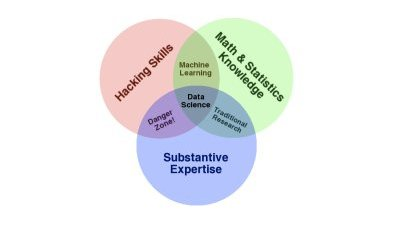  | 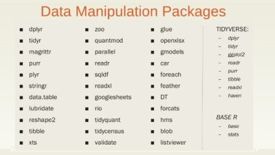  | 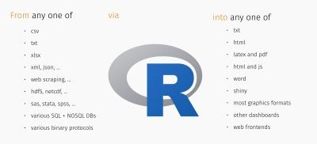 |

# <center>Data Analytics</center>

---

| 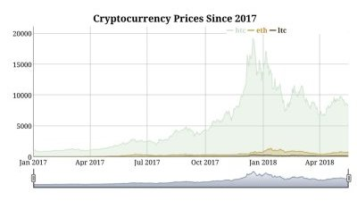 | 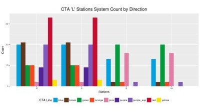 | 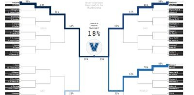 |

# <center>Machine Learning</center>

---

| 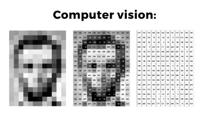  | 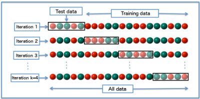  | 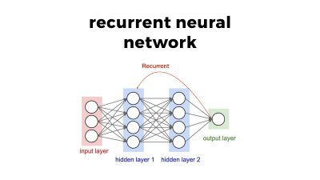 |

# <center>Data Visualization</center>

---

| 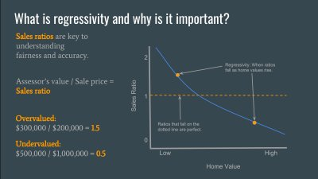 | 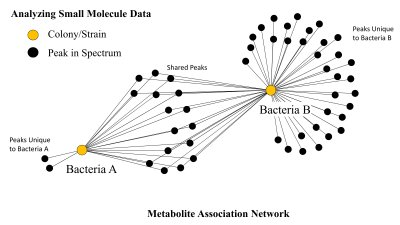  | 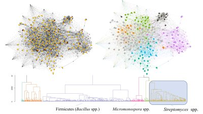  |

# <center>Extensions and Interfacing</center>

---

| 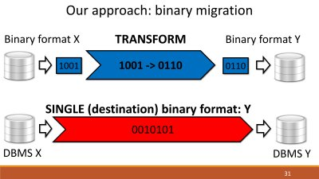 | 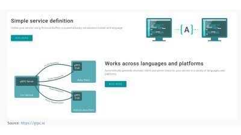 | 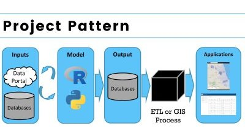 |


