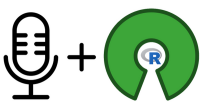
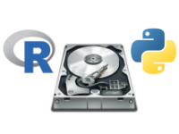
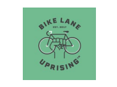
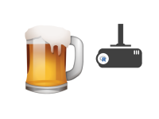
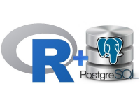
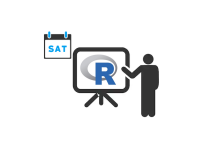
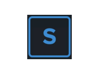
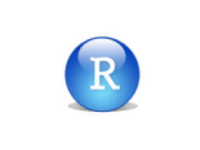
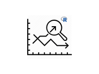

<nav>
  <ul>
    <li id="selected"><a href="index.html">Home</a></li>
    <li><a href="mission.html">Mission</a></li>
    <li><a href="sponsors.html">Sponsors</a></li>
    <li><a href="resources.html">Resources</a></li>
    <li><a href="about-us.html">About Us</a></li>
    <li><a href="find-us.html">Find Us</a></li>
  </ul>
</nav>
 

We are the Chicago R User Group (CRUG), a local-area meetup group who organizes and host events for users in the R environment. Our events foster collaboration, education, and networking in the data and programming Chicago ecosystem. See below our past events and projects, diving into the entire spectrum of data analytics and data science. 

---

# 
<strong>2019 Meetups</strong>
 

| [**2019-n6-useR-2019-bRew-and-View**   ](https://github.com/Chicago-R-User-Group/2019-n6-useR-2019-bRew-and-View)          | [**2019-n5-Joint-Meetup-Chicago-Women-In-Big-Data**   ](https://github.com/Chicago-R-User-Group/2019-n5-Joint-Meetup-Chicago-Women-In-Big-Data)  | [**2019-n4-Pre-R-Finance-Talks-and-an-Open-Mic**   ](https://github.com/Chicago-R-User-Group/2019-n4-Pre-R-Finance-Talks-and-an-Open-Mic) |
| [**2019-n1-Single-Fct-Lightning-Talks**   ](https://github.com/Chicago-R-User-Group/2019-n1-Single-Function-Lightning-Talks) | [**2019-n2-Hardware-for-Data-Science**   ](https://github.com/Chicago-R-User-Group/2019-n2-Hardware-for-Data-Science)                   | [**2019-n3-Big-Data-and-Biking**   ](https://github.com/Chicago-R-User-Group/2019-n3-Big-Data-and-Biking)               |

&nbsp;

# 
<strong>2018 Meetups</strong>
 

| [**2018-n9-bRew-and-View**    ](https://github.com/Chicago-R-User-Group/2018-n9-bRew-and-View)         | [**2018-n8-Hacktoberfest**    ](https://github.com/Chicago-R-User-Group/2018-n8-Hacktoberfest)               | [**2018-n7-CRUG-PUG**   ](https://github.com/Chicago-R-User-Group/2018-n7-CRUG-PUG)                              |
| [**2018-n6-CRUG-ChiPy**     ](https://github.com/Chicago-R-User-Group/2018-n6-CRUG-ChiPy)                | [**2018-n5--Pre-RFinance-meetup**    ](https://github.com/Chicago-R-User-Group/2018-n5--Pre-RFinance-meetup)  | [**2018-n4-R-from-the-Beginning**    ](https://github.com/Chicago-R-User-Group/2018-n4-R-from-the-Beginning) |
| [**2018-n3-Double-Feature**   ](https://github.com/Chicago-R-User-Group/2018-n3-Double-Feature)  | [**2018-n2-Data-Robot-Talks**     ](https://github.com/Chicago-R-User-Group/2018-n2)                            | [**2018-n1-Happy-New-YeaR**     ](https://github.com/Chicago-R-User-Group/2018-n1-Happy-New-YeaR)                  |

&nbsp;

# 
<strong>2017 Meetups</strong>
 

| [**2017-n7-Machine-Learning**   ](https://github.com/Chicago-R-User-Group/2017-n7-Machine-Learning-High-Frequency-Time-Series)  | [**2017-n6-SatuRday-short-talks**     ](https://github.com/Chicago-R-User-Group/2017-n6-meetup-SatuRday-short-talks)  | [**2017-n5-Meetup-SolarFlares**   ](https://github.com/Chicago-R-User-Group/2017-n5-Meetup-SolarFlares) |
| ...                                                                                                                                                                                      | [**2017-n4-Syberia**      ](https://github.com/Chicago-R-User-Group/2017-n4-Meetup-Syberia)                                    | ...                                                                                                                                             |
| [**2017-n3-Meetup-RStudio**   ](https://github.com/Chicago-R-User-Group/2017-n3-Meetup-RStudio)                                                 | [**2017-n2-Predictive-Financial**     ](https://github.com/Chicago-R-User-Group/2017-n2-Meetup)                              | [**2017-n1-Meetup-New-Year-New-to-R**      ](https://github.com/Chicago-R-User-Group/2017-n1-Meetup)   |

&nbsp;

# 
<strong>2011-2016 Meetups</strong>
 

| [**2016 Meetups**   ](https://github.com/Chicago-R-User-Group/2016-Meetups) | **2015 Meetups**                                                            | [**2014 Meetups**   ](https://github.com/Chicago-R-User-Group/2014-Meetups) |
| [**2013 Meetups**   ](https://github.com/Chicago-R-User-Group/2013-Meetups) | [**2012 Meetups**   ](https://github.com/Chicago-R-User-Group/2012-Meetups) | [**2011 Meetups**   ](https://github.com/Chicago-R-User-Group/2011-Meetups) |

&nbsp;

---

## 
From base R apply family to machine learning with keras to the extendability of R to big data loading and migration, our events are filled with analytical passion among our speakers, audiences, members, and organizers!

&nbsp;

# 
General Discussion

---

|   |   |  |

# 
Data Analytics

---

|  |  |  |

# 
Machine Learning

---

|   |   |  |

# 
Data Visualization

---

|  |   |   |

# 
Extensions and Interfacing

---

|  |  |  |

