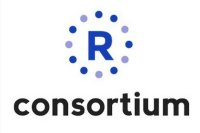

<table id="headers">
  <tbody>
    <tr>
      <td><a href="index.html">Home</a></td>
      <td><a href="mission.html">Mission</a></td>
      <td><a href="resources.html">Resources</a></td>
      <td><a href="sponsors.html">Sponsors</a></td>
      <td><a href="about-us.html">About Us</a></td>
      <td><a href="find-us.html">Find Us</a></td>
    </tr>
  </tbody>
</table>

# <u>Sponsors</u>
Below are current sponsors who help provide refreshments, venues, and overall support of our endeavors.

# **Microsoft**

# **IBM**

# **R Consortium**

# **Others**

